# PaperMind 论文精读平台

私有化论文精读系统：双语阅读、划词 AI 翻译/总结、截图 OCR、知识图谱、社区协作、团队与分享。

技术栈：**Django + DRF**（后端）· **Vue3 + Element Plus**（前端）· **MySQL / SQLite** · **Nginx** · **Docker** · **PaddleOCR** · **DeepSeek API**

---

## 功能概览

| 模块 | 能力 |
|------|------|
| 用户 | 注册/登录（JWT）、个人中心、偏好设置、引擎连通性探测 |
| 文献库 | 分类/状态/标签、回收站、本地导入、arXiv 检索导入、分享 |
| 阅读器 | 中英对照、划词翻译总结（可编辑）、高亮/笔记（三档可见性）、章节大纲、截图 OCR、进度同步 |
| AI | 六段式精读总结、术语表、段落翻译缓存、论文问答（DeepSeek） |
| 解析 | **PDF 文本解析**（PyMuPDF） / **PaddleOCR** / **MinerU**（需 mineru-api） |
| 知识库 | 统计卡、知识卡片、术语、笔记聚合、Obsidian Markdown 导出 |
| 图谱 | 力导向图、知识点搜索推荐、从文献库同步 |
| 社区 | 公开动态流、点赞评论、团队创建/申请/审批、论文分享 |

---

## 界面预览

> 以下截图来自**实际运行的 Django + Vue3 全栈服务**（Edge 无头浏览器真实渲染），
> 登录账号分别为管理员（`demo@papermind.local`）与普通用户，界面随角色权限区分。

### 管理员视角

#### 发现首页

搜索（含热门词）、论文推荐卡片、热榜与导入入口：

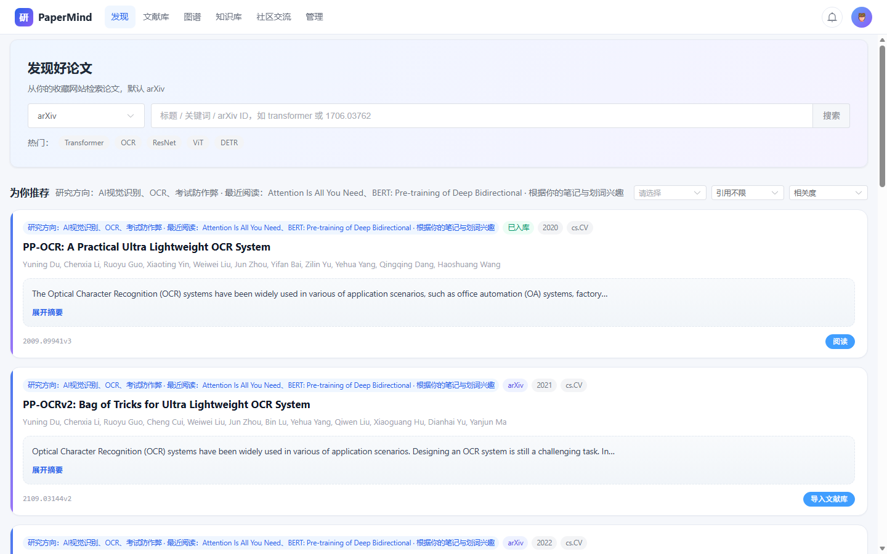

#### 文献库

我的文献 / 收藏网站 / 阅读器 / 导入文献四 Tab 闭环，支持分类、标签、回收站：

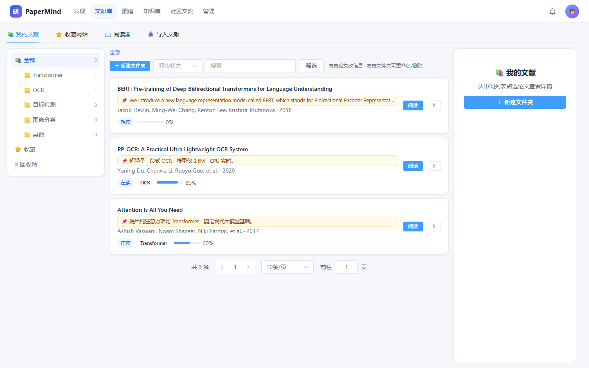

#### 阅读器

三栏布局（大纲 / 正文 / AI+笔记），支持原文、中英对照、划词翻译 / 5 色高亮 / 笔记 / AI 问答。下方为真实解析出的论文正文（PyMuPDF + OCR）：

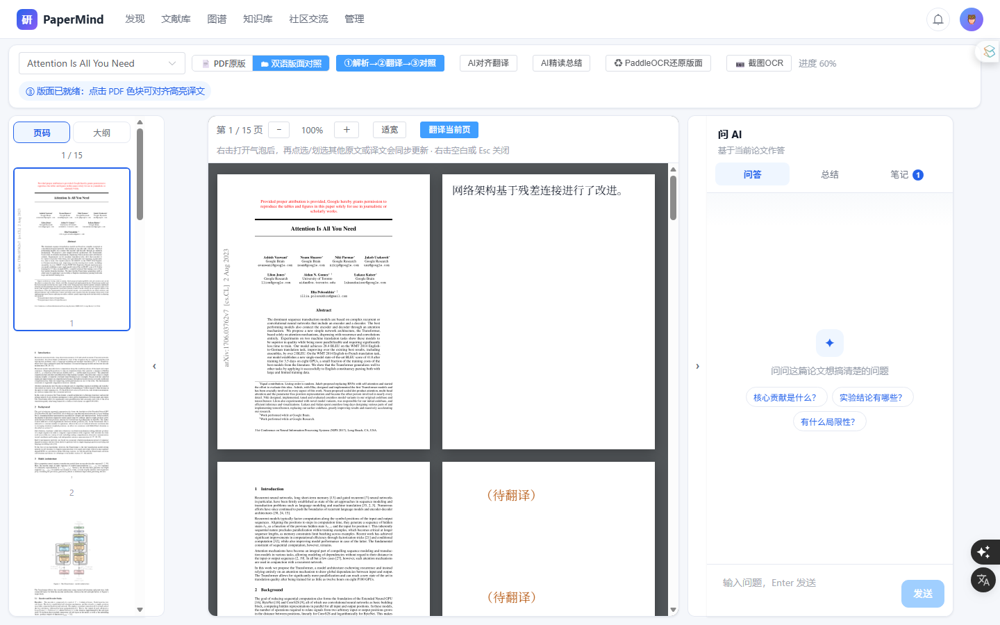

#### 知识图谱

Canvas 力导向图，论文 + 概念节点、引用方向边、中心论文 BFS 展开、知识点搜索推荐：

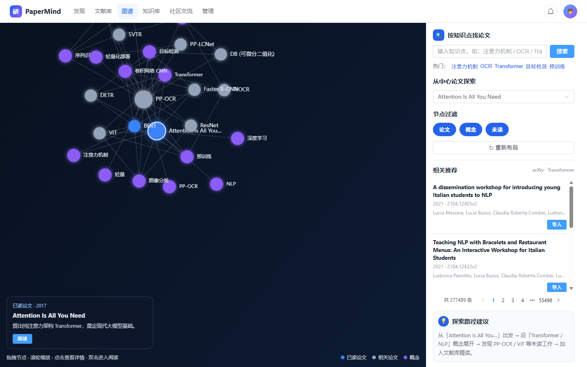

#### 知识库

知识资产统计、AI 知识卡片、跨论文术语库、笔记聚合、Obsidian Markdown 导出：

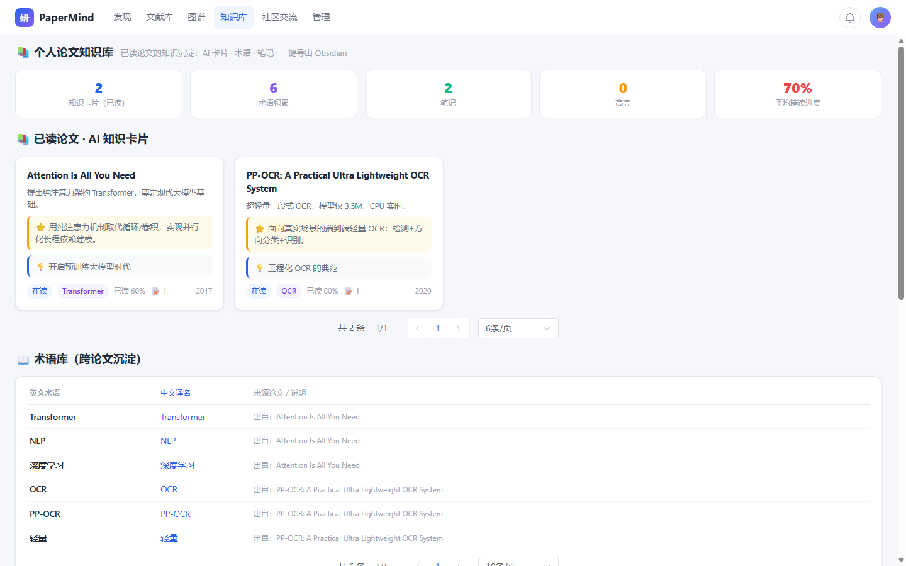

#### 社区交流

公开动态流、点赞评论、团队创建 / 申请 / 审批、论文分享：

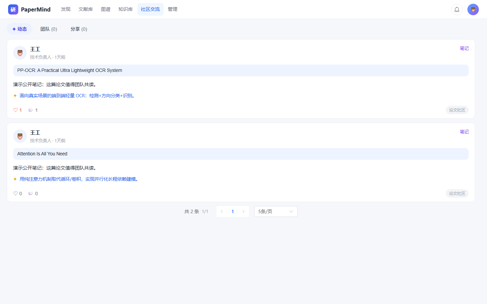

#### 个人中心

统计卡片、最近阅读、笔记汇总、偏好设置（翻译 / OCR 引擎）：

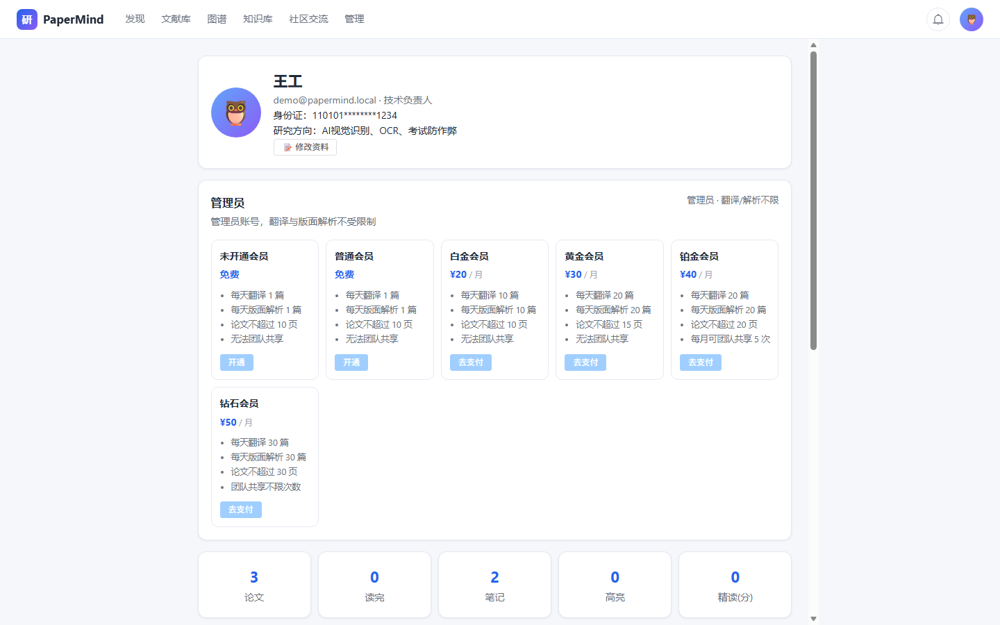

#### 管理后台（仅管理员可见）

用户管理 / 会员套餐 / 支付订单，可编辑用户、重置密码、删除；普通用户访问 `/admin` 会被自动重定向回首页：

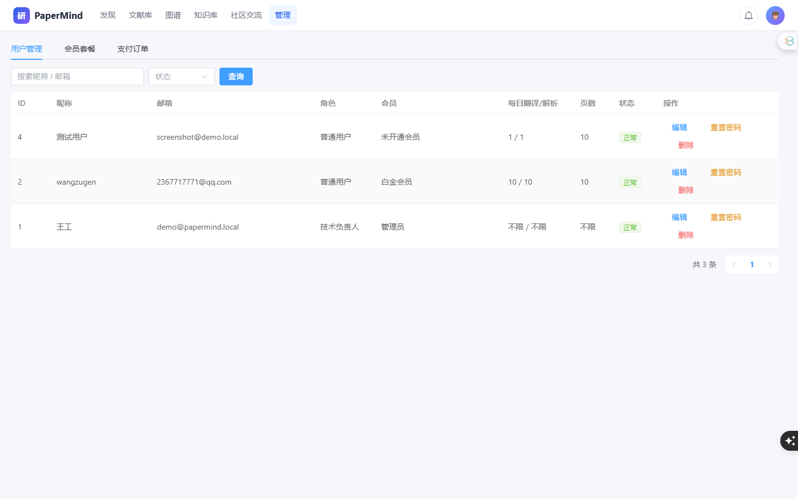

### 普通用户视角

普通用户登录后顶栏**不显示「管理」入口**，无法进入管理后台；个人中心会员状态为「未开通会员」：

| 页面 | 截图 | 与管理员差异 |
|------|------|------|
| 发现首页 | 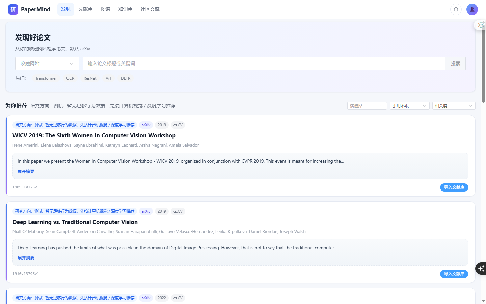 | 顶栏无「管理」入口 |
| 个人中心 | 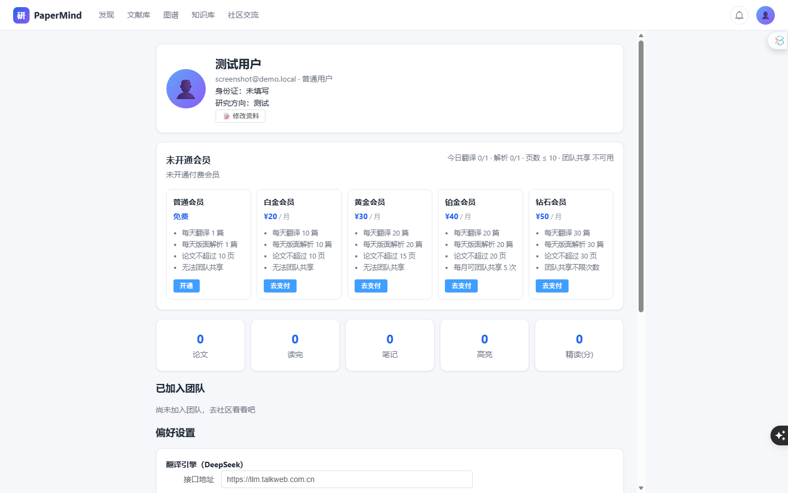 | 会员状态「未开通会员」、无管理员标识 |
| 社区交流 | 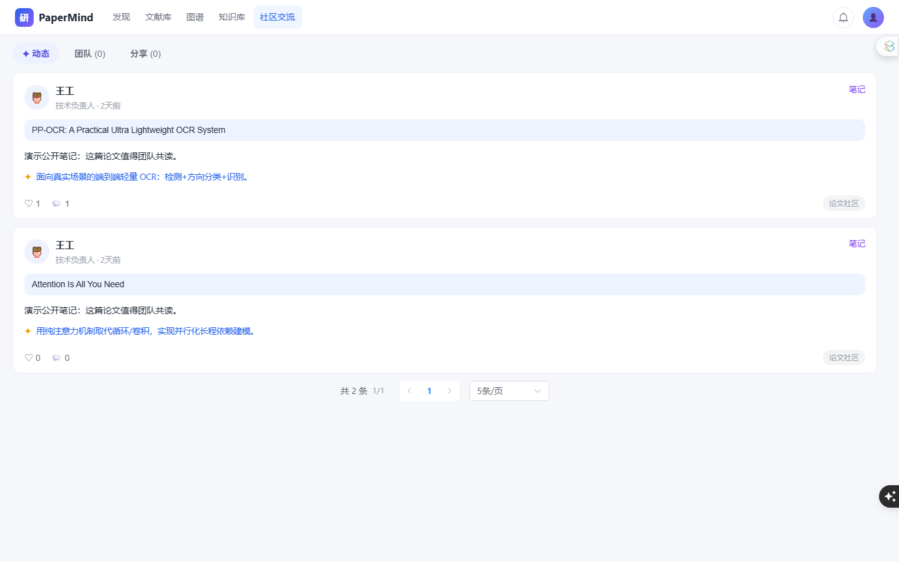 | 功能相同，无管理相关操作 |

---

## 快速开始（本地开发）

### 环境要求

- Python 3.11+
- Node.js 18+
- （可选）Redis、MySQL 8、Docker

### 1. 后端

```bash
cd backend
python -m venv .venv

# Windows
.venv\Scripts\activate
# Linux / macOS
source .venv/bin/activate

pip install -r requirements.txt
copy .env.example .env   # Windows
# cp .env.example .env   # Linux

# 编辑 .env，填入 DEEPSEEK_API_KEY
python manage.py migrate
python manage.py seed_demo
python manage.py runserver 0.0.0.0:8000
```

演示账号：`demo@papermind.local` / `demo123456`

API 文档：http://127.0.0.1:8000/api/docs/

### 2. 前端

```bash
cd frontend
npm install
npm run dev
```

访问：http://127.0.0.1:5173 （已代理 `/api` → Django）

### 3. DeepSeek 翻译 / 总结

在 `backend/.env` 或个人中心「偏好设置」配置：

```
DEEPSEEK_API_KEY=sk-xxx
DEEPSEEK_BASE_URL=https://api.deepseek.com
DEEPSEEK_MODEL=deepseek-chat
```

说明：文档约定使用 **deepseek-v4**；若账号已开通对应模型，将 `DEEPSEEK_MODEL` 改为 `deepseek-v4`（或控制台给出的实际模型名）即可。未配置 Key 时接口返回离线占位文案，不影响其他功能联调。

### 4. OCR（可选，本地）

```bash
cd deploy/ocr
pip install -r requirements.txt
uvicorn app:app --host 0.0.0.0 --port 8866
```

导入扫描版 PDF 时选择「OCR 解析」；阅读器截图 OCR 也会调用该服务。也可换成 MinerU：在偏好设置中将 Provider 设为 `mineru` 并填写服务地址。

---

## Docker 一键部署（Linux / Windows）

适用于 Docker Desktop（Windows/macOS）或 Linux Docker Engine。

```bash
# 项目根目录
cp backend/.env.example .env
# 编辑 .env 填入 DEEPSEEK_API_KEY、SECRET_KEY 等

docker compose up -d --build
```

访问：

- 站点：http://localhost
- 管理后台：http://localhost/admin/
- API：http://localhost/api/docs/

服务组成：

| 容器 | 说明 |
|------|------|
| `pm-nginx` | 反向代理、静态资源、上传体积限制 |
| `pm-frontend` | Vue 构建产物 |
| `pm-backend` | Gunicorn + Django |
| `pm-celery` | 异步任务 Worker |
| `pm-mysql` | MySQL 8 |
| `pm-redis` | Celery Broker |
| `pm-ocr` | PaddleOCR HTTP 服务（8866） |

常用命令：

```bash
docker compose logs -f backend
docker compose exec backend python manage.py createsuperuser
docker compose down
```

### Windows 注意

1. 安装 [Docker Desktop](https://www.docker.com/products/docker-desktop/)，启用 WSL2。
2. 克隆/放置项目路径避免过深且无中文特殊字符更佳。
3. 首次构建 OCR 镜像会下载 Paddle 模型，耗时较长。

### Linux 生产建议

- 修改默认 MySQL 密码与 `SECRET_KEY`
- 在 `deploy/nginx/nginx.conf` 增加 HTTPS（证书挂载）
- OCR 需要 GPU 时可启用 compose 中的 nvidia device 注释段

---

## 论文解析说明

1. **PDF 解析**：优先用 PyMuPDF 提取文本块，识别章节大纲，写入 `papers.content_json`。
2. **OCR 解析**：文本极少（扫描件）或用户显式选择 OCR 时，将页面渲染为图片后调用 PaddleOCR。
3. **翻译**：段落级调用 DeepSeek，结果写入 `paragraph_translations` 缓存，避免重复消耗。

---

## 目录结构

```
paper-reader/
├── backend/           # Django 项目
│   ├── accounts/ papers/ reader/ community/ teams/
│   ├── ai_engine/ graph/ vault/
│   └── services/      # PDF / OCR / DeepSeek / arXiv
├── frontend/          # Vue3
├── deploy/
│   ├── nginx/nginx.conf
│   └── ocr/           # PaddleOCR 微服务
├── docs/              # PRD / 原型 / 数据库设计
└── docker-compose.yml
```

---

## 环境变量摘要

| 变量 | 说明 |
|------|------|
| `SECRET_KEY` | Django 密钥 |
| `DB_ENGINE` | `sqlite` 或 `mysql` |
| `DEEPSEEK_API_KEY` | DeepSeek API Key |
| `DEEPSEEK_MODEL` | 默认 `deepseek-chat`，可改为 `deepseek-v4` |
| `OCR_SERVICE_URL` | OCR 服务地址，默认 `http://127.0.0.1:8866` |

---

## License

内部团队使用 · PaperMind © 2026
